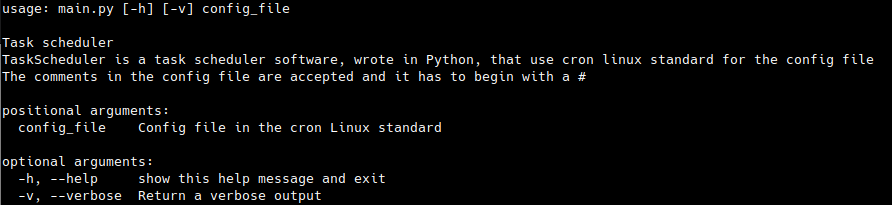

# TaskScheduler
TaskScheduler is a task scheduler software, wrote in Python, that use cron linux standard for the config file
The comments in the config file are accepted and it has to begin with a #



For run use 
```
python3 main.py config_file
```